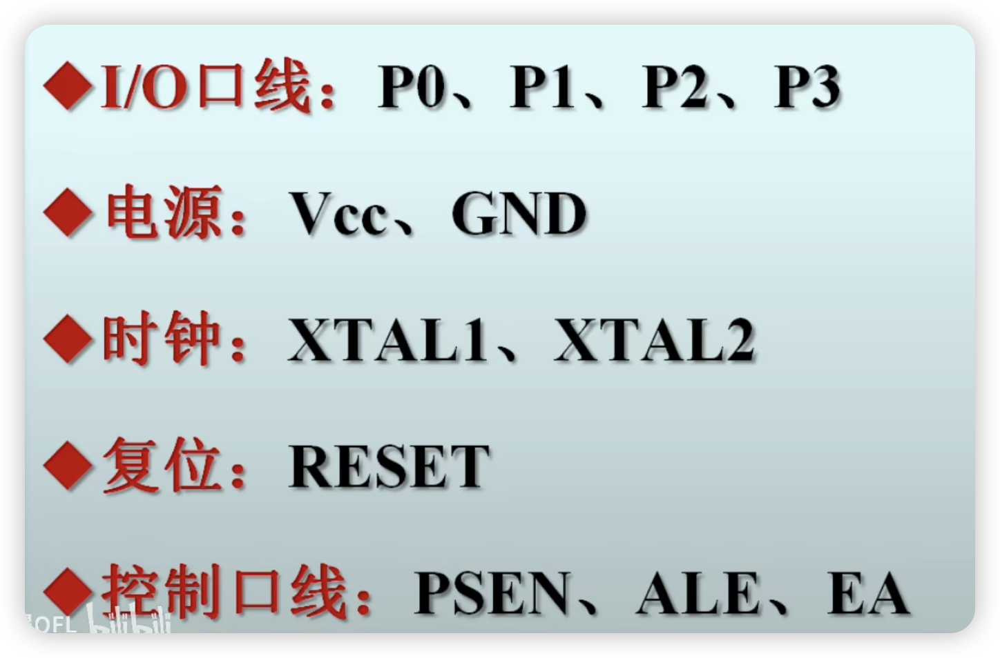
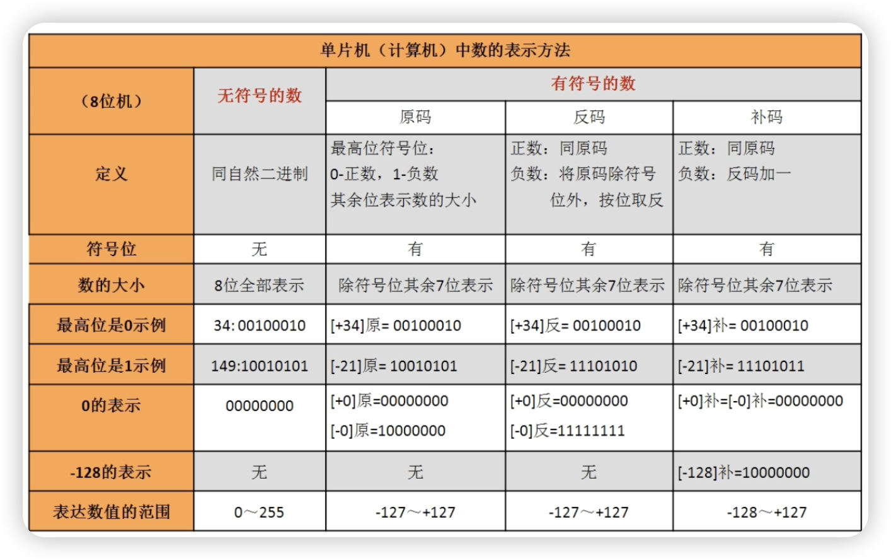

- 内部结构
- 外部引脚
- 基本的 IO 口应用
- 定时器
- 中断系统
- 串口

## 1.1 学习准备

### 准备环境

1. kei5 生成 HEX 文件
2. CH340 的驱动文件（USB转串口）
3. 下载软件 stc-isp PZ-ISP

### 下载

连接电脑识别串口号，安装条线帽


1. 选好型号
2. 指定 HEX 文件
3. 下载
4. 给电路板断电
5. 给电路板上电（断电再上电称为冷启动）


## 1.2 新建工程

1. 新建工程命令（工程文件夹创建工程文件）

2. 选择对应芯片

3. 新建 C 代码文件（语言为C51）

    ```
    #include "reg52.h"
    void main()
    {
    		p1=0x00;
    }
    ```

    

4. 将 C 文件加入工程

## 1.3 点亮 LED

1. 根据原理图得知，想点亮LED需要给对应端口低电平，也就是 0(0和1称为模拟量)

    ```
    #include "reg52.h"
    void main()
    {
    		P0=0x00;
    }
    ```

    - 进行编译后提示创建了了hex文件（如果没有，在output中勾选相应选项）

    - 选择芯片型号、查看串口、打开程序文件、下载/编程 一套丝滑小连招

2. 延时程序

    ```
    #include <reg52.h>
    void main()
    {
    		int i;
    		while(1)
    		{
    				P0=0x00;
    				for(i=0;i<10000;i++);
    				P0=0xff;
    				for(i=0;i<10000;i++);
    		}
    }
    ```

3. 查询延时时间

    - 设置一下晶振 （视频中为11.0592）
    - 调试（打断点、监视变量）

4. 延时子程序

    ```c
    #include <reg52.h>
    void delay1ms()
    {
    		int i;
    		for(i=114;i>0;i--);
    }
    /*void delay1ms()
    {
    		int i=100;
    		while(i--);
    }*/
    void delay10ms()
    {
    	int i = 1000;
    	while(i--);
    }
    void delay100ms()
    {
    	int i = 10000;
    	while(i--);
    }
    void delay(int ms)
    {
    		int i,j;
    		for(j=ms;j>0;j--)
    			for(i=114;i>0;i--);
    }
    void main()
    {
    		while(1)
    		{
    				P0=0x00;
    				delay(1000);
    				P0=0xff;
    				delay(1000);
    		}
    }
    ```

## 1.4 keil使用技巧

- 注释 GB2312
- Go To Definition Of ‘Speed’
- 设置一个Tab 占用4个字符

## 1.5 C51易错汇总

- 未用Tab键退格
- 多或少了{}
- 大小写末区分
- 少分号：
- 多分号；
- 变量赋值超限
- 函数未声明
- 位，未声明
- 多个main
- 未加入工程
- 找不到hex文件
- 查看时长对不上

## 2.1 内部结构

1. 单片机是什么：超大规模的集成电路。 
2. 内部结构
    1. CPU
    2. 存储器
3. 芯片制造初识

## 2.2 外部引脚

STC89C52RC

- 4个IO口（P0 P1 P2 P3），每个口8个引脚
- 供电VCC，GND（VSS）
- RESET复位
- 时钟--为CPU提供时序1-2us （XTAL1 XTAL2）
- 扩展rom ram



## 2.3 单片机中数的表示



- 计算机中有符号的数是以补码存储的
- 8位机负数补码的计算公式：（负数）补 = 256 + 负数
    - [-21]补 = 256 - 21 = 1110 1011


## 2.4 时钟周期 机器周期

- 时钟周期：是单片机时序中的最小单位，是时钟频率的倒数

    - 时钟频率：1秒中振荡多少次

    

-  机器周期：是单片机完成一个操作最短的时间
    也就是CPU执行语句
    所需要时间的最小单位。

    

    

    

    

    串口使用中，可以获得准确的波特率

## 2.5 LED 流水灯实现

```c
#include <reg51.h>
#define uint unsigned int
#define uchar unsigned char
//软件延时
void delay(void)
{
	uint i;
	for(i=0; i<25530;i++);
}
void main()
{
	uchar i,j,n,m,k;
	while(1)
  {
  //1.发光二极管由上到下再由下到上来回流动，循环两次；
      for(i=0;i<2;i++)
      {
        n=0x01;
        for(j=0;j<8;j++)
        {
          P0=~n;
          delay();
          n=n<<1;
          //n<<j+1;
        }
        n=0x80;
        for(j=0;j<8;j++)
        {
          P0=~n;
          delay();
          n=n>>1;
        }
      }
  //2.发光二极管先由上至下依次增加，再由下至上依次减少来回流动，循环两次
  		for(i=0;i<2;i++)
  		{
  			n=0xfe;
  			for(j=0;j<8;j++)
  			{
  				P0=n;
  				delay();
  				delay();
  				n=n<<1;
  			}
  			n=0x7f;
  			for(j=0;j<8;j++)
  			{
  				P0=~n;
  				delay();
  				delay();
  				n=n>>1;
  				
  			}
  		}
  //3.发光二极管分别从两边往中间流动，循环两次：
    	for(i=0;i<2;i++)
      {
        n=0x01;
        m=0x80;
        for(j=0;j<4;j++)
        {
          k=n|m;
          P0=~k;
          delay();
          delay();
          n=n<<1;
          m=m>>1;
        }
      }
    //4.发光二极管从中间往两边流动。
    	for(i=0;i<2;i++)
      {
        n=0x08;
        m=0x10;
        for(j=0;j<4;j++)
        {
          k=n|m;
          P0=~k;
          delay();
          delay();
          n=n>>1;
          m=m<<1;
        }
      }
    //5.发光二极管分别从两边往中间递增和递减流动
    	for(i=0;i<2;i++)
      {
        n=0x08;
        m=0x10;
        for(j=0;j<4;j++)
        {
          k=n|m;
          P0=~k;
          delay();
          delay();
          n=n<<1;
          n=n|0x01;
          m=m>>1;
          m=m|0x80;
      }
  }
}

```

## 2.6 单片机是如何执行程序的

## 3.1 PWM 实现呼吸灯

脉冲宽度调制PWM：通过改变脉冲宽度来改变电压的输出

 ~~~
 #define uchar unsigned char
 #define uint unsigned int
 void delay(uint ms)
 {
 	uint i,j;
 	for(i=ms;i>0;i--)
 		for(j=114;j>0;j--);
 }
 void main()
 {
 	uchar t;
 	while(1)//分别测试5ms 100ms 500ms
 	{
 		P0=0xff;
 		delay(5);
 		P0=0x00;
 		delay(5);
 	}
 }
 ~~~

